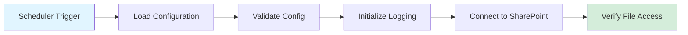
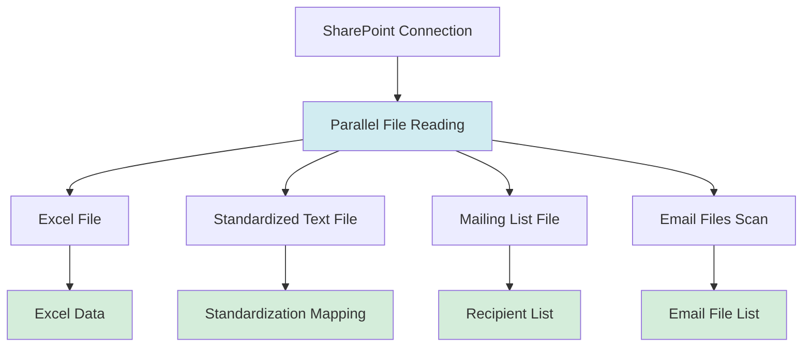
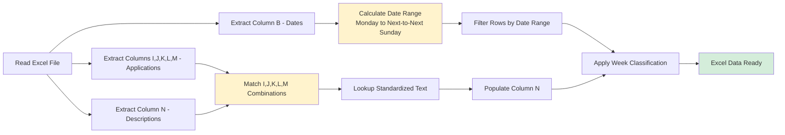
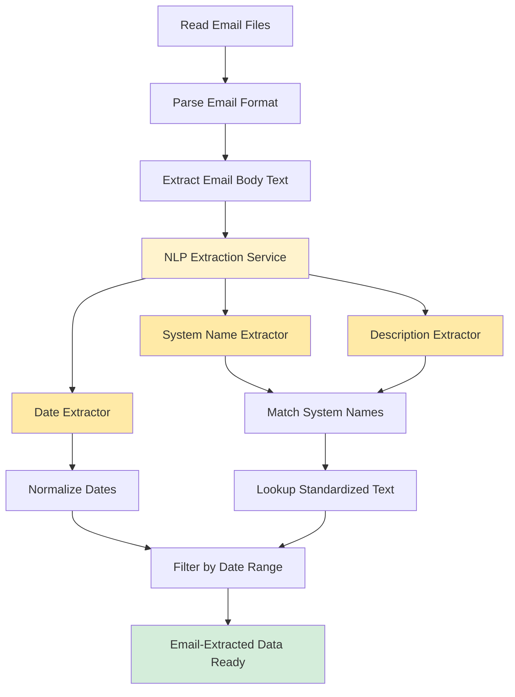
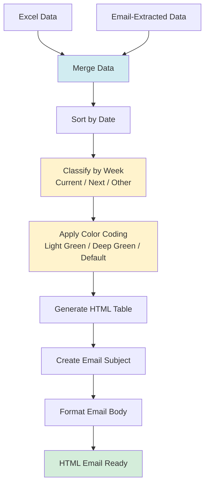
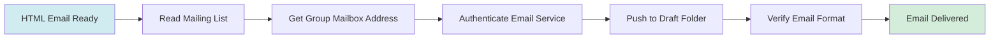
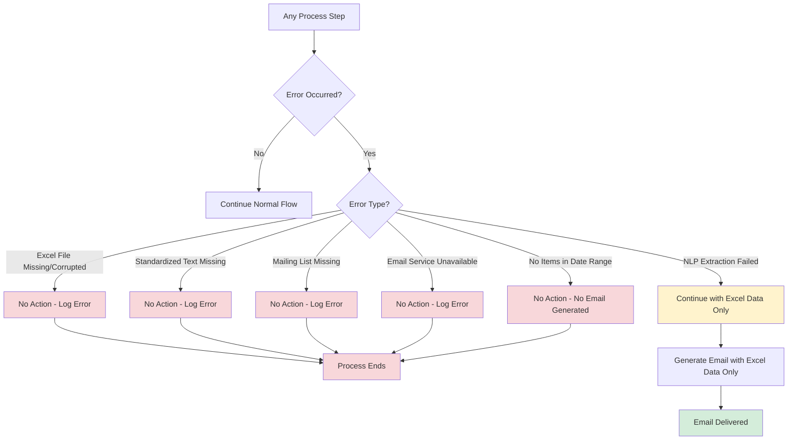

# High-Level Workflow Diagram: AI-Powered Downtime Notification Mailing System

## System Overview

This document provides a high-level workflow diagram showing the end-to-end process flow of the AI-Powered Downtime Notification Mailing System.

## Main Workflow

```mermaid
flowchart TD
    Start([Scheduler: Monday Trigger]) --> CheckDay{Is Today Monday?}
    CheckDay -->|No| Wait[Wait for Monday]
    Wait --> CheckDay
    CheckDay -->|Yes| Init[Initialize System]
    
    Init --> ReadConfig[Read Configuration]
    ReadConfig --> ConnectSP[Connect to SharePoint]
    
    ConnectSP --> ReadFiles[Read Files from SharePoint]
    ReadFiles --> ReadExcel[Read Excel File]
    ReadFiles --> ReadStdText[Read Standardized Text File]
    ReadFiles --> ReadMailingList[Read Mailing List File]
    ReadFiles --> ReadEmailFiles[Scan for Email Files]
    
    ReadExcel --> CalcDateRange[Calculate Date Range<br/>Monday to Next-to-Next Sunday]
    CalcDateRange --> FilterExcel[Filter Excel Rows by Date Range]
    FilterExcel --> MatchStdText1[Match Application Combinations<br/>I,J,K,L,M → Column N]
    MatchStdText1 --> ExcelData[(Excel Data Ready)]
    
    ReadEmailFiles --> ParseEmails[Parse Email Files<br/>.eml, .msg, .mbox]
    ParseEmails --> ExtractNLP[NLP Extraction Service]
    ExtractNLP --> ExtractDate[Extract Dates from Natural Language]
    ExtractNLP --> ExtractSystems[Extract System/Application Names]
    ExtractNLP --> ExtractDesc[Extract Descriptions]
    ExtractDate --> NormalizeDate[Normalize Dates to Excel Format]
    ExtractSystems --> MatchStdText2[Match Extracted Systems<br/>against Standardized Text]
    ExtractDesc --> MatchStdText2
    NormalizeDate --> FilterEmail[Filter by Date Range]
    MatchStdText2 --> FilterEmail
    FilterEmail --> EmailData[(Email-Extracted Data Ready)]
    
    ExcelData --> MergeData[Merge Excel + Email Data]
    EmailData --> MergeData
    
    MergeData --> ClassifyWeek[Classify Items by Week<br/>Current Week / Next Week / Other]
    ClassifyWeek --> ApplyColors[Apply Color Coding<br/>Light Green / Deep Green / Default]
    ApplyColors --> GenerateHTML[Generate HTML Email Template]
    GenerateHTML --> FormatTable[Format Table with Color Coding]
    FormatTable --> CreateSubject[Create Email Subject Line<br/>Updates from [Date] to [Date]]
    
    CreateSubject --> ReadMailingList
    ReadStdText --> MatchStdText1
    ReadStdText --> MatchStdText2
    
    CreateSubject --> DeliverEmail[Deliver to Draft Folder]
    DeliverEmail --> End([Email in Draft Folder])
    
    %% Error Handling Paths
    ConnectSP -->|Error| NoAction1[No Action - Log Error]
    ReadExcel -->|Error| NoAction2[No Action - Log Error]
    ReadStdText -->|Error| NoAction3[No Action - Log Error]
    ReadMailingList -->|Error| NoAction4[No Action - Log Error]
    ExtractNLP -->|Error| ContinueExcel[Continue with Excel Data Only]
    ContinueExcel --> ExcelData
    DeliverEmail -->|Error| NoAction5[No Action - Log Error]
    
    NoAction1 --> EndError([Process Ends - No Email Generated])
    NoAction2 --> EndError
    NoAction3 --> EndError
    NoAction4 --> EndError
    NoAction5 --> EndError
    
    style Start fill:#e1f5ff
    style End fill:#d4edda
    style EndError fill:#f8d7da
    style ExtractNLP fill:#fff3cd
    style MergeData fill:#d1ecf1
    style GenerateHTML fill:#d1ecf1
```

## Detailed Component Workflow

### 1. Initialization and Configuration Phase



### 2. Data Collection Phase



### 3. Excel Processing Pipeline



### 4. Email Processing and NLP Extraction Pipeline



### 5. Data Merging and Email Generation Phase



### 6. Email Delivery Phase



## Error Handling Flow



## Key Decision Points

1. **Monday Check**: System only processes on Mondays
2. **Date Range Filter**: Only items within Monday to next-to-next Sunday are included
3. **Week Classification**: Items are classified as Current Week, Next Week, or Other
4. **Error Handling**: "No Action" approach - system logs errors but doesn't generate partial emails
5. **NLP Fallback**: If NLP extraction fails, system continues with Excel data only

## Data Flow Summary

```
SharePoint Files
    ├── Excel File → Excel Processing → Excel Data
    ├── Standardized Text File → Text Matching → Standardization Mapping
    ├── Mailing List File → Email Delivery → Recipient List
    └── Email Files → NLP Extraction → Email-Extracted Data
                            ↓
                    Merge Data → Generate Email → Deliver to Draft Folder
```

## High-Level Task Groups

Based on the workflow, the implementation tasks are organized into these groups:

1. **Infrastructure & Setup** (Tasks 1.0, 12.0)
   - Project structure, configuration, dependencies

2. **Data Access Layer** (Tasks 2.0, 3.0, 6.0)
   - SharePoint integration, Excel reading, Email file parsing

3. **Data Processing Layer** (Tasks 4.0, 5.0, 7.0)
   - Date calculations, text matching, NLP extraction

4. **Email Generation Layer** (Tasks 8.0, 9.0)
   - Template generation, formatting, delivery

5. **Automation Layer** (Task 10.0)
   - Scheduling, continuous running

6. **Supporting Systems** (Tasks 11.0, 13.0)
   - Error handling, logging, testing

